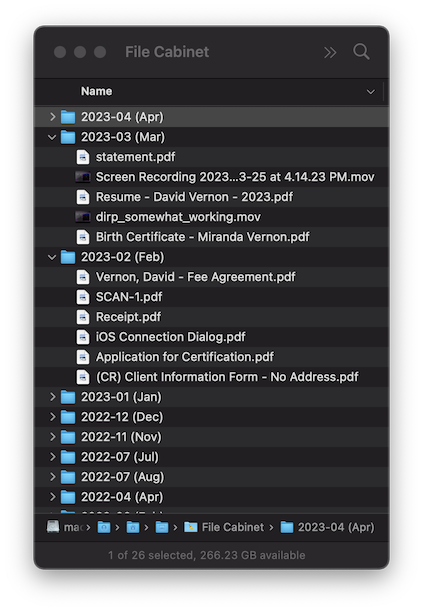

# tidii

A Desktop Organizer. Do you tend to keep a messy desktop? Do you hate that?

Tidii creates a directory on the Desktop called "File Cabinet". It then monitors files on the desktop. If a file goes for a while (configurable) without being accessed then it is moved into the File Cabinet, and then further organized by the month of the year.

As an example, this is what my File Cabinet looks like at the time that I am writing this. 



This may seem like a silly little utility (and it is) but I am consistently amazed by how nice it is.

## Usage

```
Usage: tidii [OPTIONS]

Options:
  -d, --days <DAYS>            Number of days to allow items to remain on the desktop
  -f, --frequency <FREQUENCY>  Frequency (in hours) to run a desktop scan
  -h, --help                   Print help
  -V, --version                Print version
```

## Install 
### Mac
Run the following from a terminal to install cpr in /usr/local/bin. 
```
/bin/bash -c "$(curl -fsSL https://raw.githubusercontent.com/DavidHVernon/tidii/master/install.sh)"
```
### Linux, WSL
Run the following from a terminal to install cpr in /usr/local/bin. (On some systems you might need to sudo this command.)
```
Coming soon...
```
### Windows
```
Coming soon...
```

## Build from Source

If you don't have rust installed: https://www.rust-lang.org/tools/install.
Then...
```
$ cargo build --release
$ ./install-dev.sh
```

## Author

[David Vernon](email:davidhvernon@mac.com)

## Version History

* 0.1.0
    * Initial release.

## License

This project is licensed under the MIT License - see the [license-mit.md](license-mit.md) file for details.

